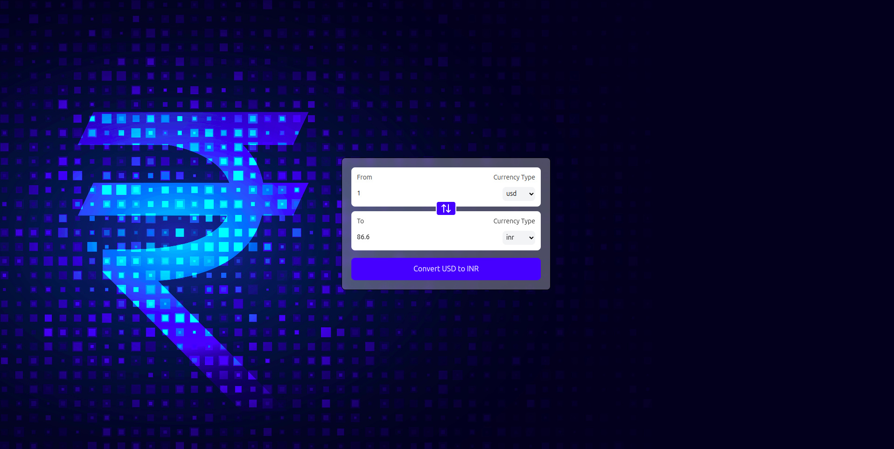

# Currency Converter

A simple currency converter app built with React that allows users to convert currencies in real-time. The app fetches live exchange rates using a custom hook and allows users to swap currencies.

## Features

- **Real-Time Conversion**: Fetches the latest exchange rates for selected currencies.
- **Swap Functionality**: Swap the "From" and "To" currencies.
- **Decimal Precision**: Converts and displays values with a fixed decimal of one place.
- **Custom Hook**: A custom React hook `useCurrencyInfo` to fetch currency data from an API.

## Technologies Used

- **React**: A JavaScript library for building user interfaces.
- **Tailwind CSS**: A utility-first CSS framework for styling.
- **Lucide Icons**: A set of high-quality icons for React.
- **Custom Hook**: `useCurrencyInfo` for fetching live currency data from an API.

## Screenshot

